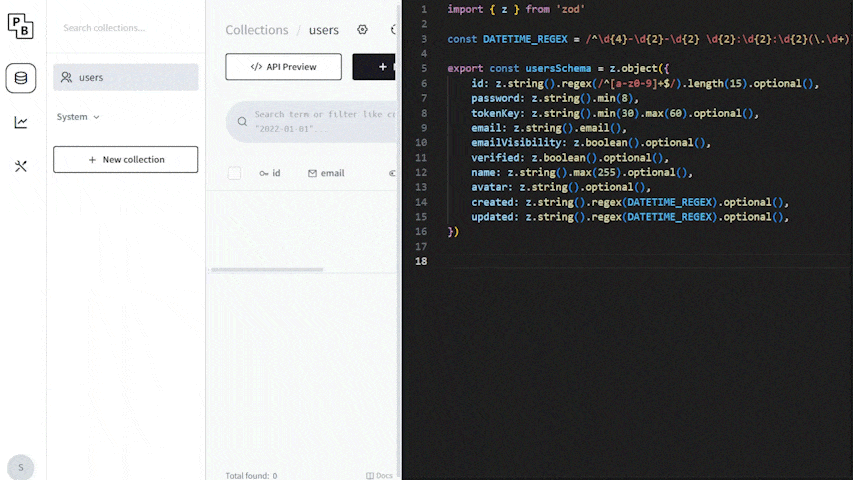

# pocketbase-schema-generator

PocketBase hook for automatically generating schemas for Zod and [pocketbase-ts](https://github.com/satohshi/pocketbase-ts).



## Usage

1. Download `pb_hooks.zip` from [releases](https://github.com/satohshi/pocketbase-ts-schema-generator/releases) and extract it to the same directory as your PocketBase executable.
2. Update `config.json` if necessary.
3. Start up the PocketBase server, and it will automatically generate/update the schema file on bootstrap and every time you make changes to the collections.
4. If you have `exposeEndpoint` set to `true`, you can access the generated schema through the endpoint you specified in `endpointPath` (e.g. `https://URL_TO_YOUR_PB_SERVER/schema`).

The generated schema will have field options in docstrings, so you will get additional information like `required`, `min`, and `max` when you hover over properties in your IDE.

## Configuration Options and Defaults

```js
{
	// If set to true, the schema will be exposed through an HTTP endpoint
	"exposeEndpoint": false,
	// Path for the schema endpoint
	"endpointPath": "/schema",
	// If set to true, the schema endpoint will require authentication
	"secureEndpoint": true,

	"tsSchema": {
		// If set to true, schema file for pocketbase-ts will be generated
		"generateFile": true,
		// If set to true, field metadata will be included as JSDoc comments
		"includeDocs": true,
		// If set to true, system collections like _superusers and _otps in the schema will be included
		"includeSystemCollections": false,
		// File path where the generated schema will be saved
		"outputPath": "./tsSchema.ts"
	},

	"zodSchema": {
		// If set to true, Zod schema file will be generated
		"generateFile": true,
		// If set to true, system collections like _superusers and _otps in the schema will be included
		"includeSystemCollections": false,
		// File path where the Zod schema will be saved
		"outputPath": "./zodSchema.ts"
	}
}
```
